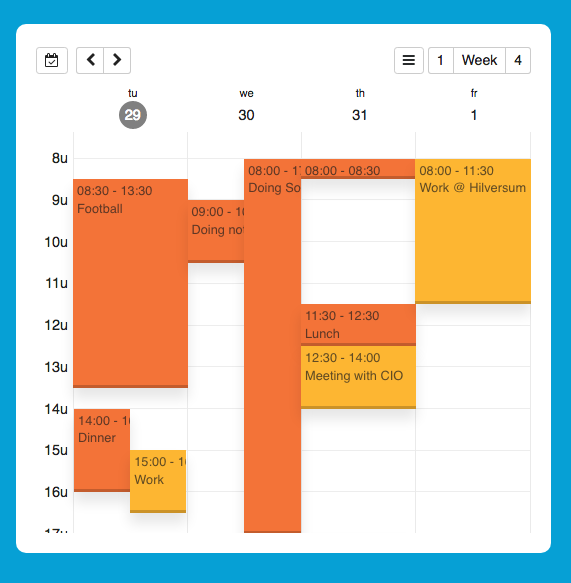

# Responsive Calendar for Vue.js

> A responsive calendar with Vue



## Usage

~~~.html
<html>
<head>
<link rel="stylesheet" href="https://maxcdn.bootstrapcdn.com/bootstrap/4.0.0-alpha.6/css/bootstrap.min.css" integrity="sha384-rwoIResjU2yc3z8GV/NPeZWAv56rSmLldC3R/AZzGRnGxQQKnKkoFVhFQhNUwEyJ" crossorigin="anonymous">
<link href="https://maxcdn.bootstrapcdn.com/font-awesome/4.7.0/css/font-awesome.min.css" rel="stylesheet" integrity="sha384-wvfXpqpZZVQGK6TAh5PVlGOfQNHSoD2xbE+QkPxCAFlNEevoEH3Sl0sibVcOQVnN" crossorigin="anonymous">
<script src="/dist/calendar.min.js"></script>
</head>
<body>

<div id="app">

    <responsive-calendar max-size="l" :events="events"></responsive-calendar>

</div>

<script>
var today = new Date();

const app = new Vue({

  el: '#app',
  data: {
    events: [{
        dateStart: new Date(today.getTime() + (21.5 * 60 * 60 * 1000)),
        dateEnd: new Date(today.getTime() + (22.5 * 60 * 60 * 1000)),
        styleClass: 'optional css class',
        summary: 'Here a summary',
        description: 'The description',
        location: 'Location'
      }
    ]

  }
});
</script>
</body>
</html>
~~~

## Build Setup

``` bash
# install dependencies
npm install

# build for production with minification
npm run build

# develop
npm run dev

```

